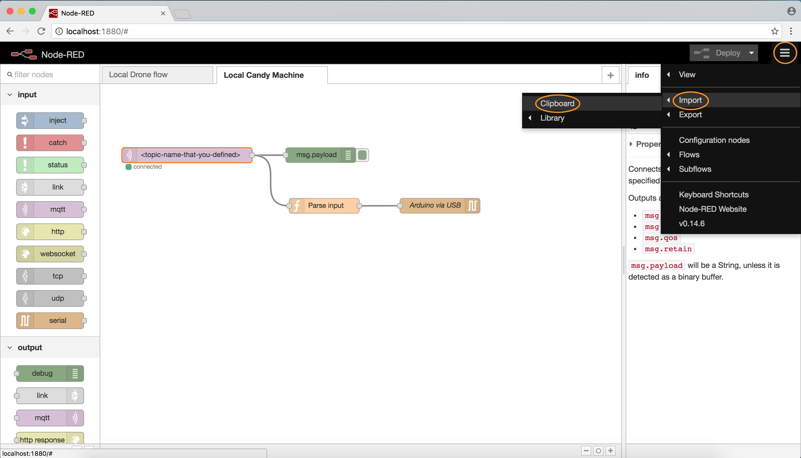

# Watson Polite Candy Machine

Use the button below to deploy the Watson Polite Candy Machine to your own Bluemix organization.
In the `app.js` file there is a variable `NODE_RED_HOST` defined at `line 11`. Change the value of this variable to match it to your own Node-RED environment.

[](https://bluemix.net/deploy?repository=https://hub.jazz.net/git/eciggaar/eci-candymachine)

## Candy machine Node-RED flows
### The flow on Bluemix

If you do not have a Node-RED environment in Bluemix, use the button below to deploy one to your organization. This environment will be preloaded with the candy machine flow.

[](https://bluemix.net/deploy?repository=https://hub.jazz.net/git/eciggaar/candymachine-nodered)

This flow can be used to test the setup by triggering both a positive and negative message. Furthermore, the requests are being published via MQTT to the local flow -- used to control the candy disposers. Finally, the requests are being logged to a Cloudant database for dashboarding purposes.

### The local flow

You need to have NodeJS and Node-RED installed locally in order to run the candy machine's local flow. Please see http://nodejs.org/ and for http://nodered.org further instructions on how to install and configure this for your platform.

The local flow is used to send a signal to the Arduino device that triggers the candy disposers to dispose some candy. To install the local flow in your environment, copy the contents of the file `resources/local_candyflow.json` to your clipboard. Ensure Node-RED is started locally and open a browser that points to your local installation of Node-RED. Normally this would be the following URL:

    http://localhost:1880

Next, select the menu at the top right and select 'Import' -> 'Clipboard' to paste the local flow from the clipboard to your canvas in Node-RED.



You should now see a flow similar to the flow as depicted in the image above. In that flow select the MQTT input node and point it to the topic that you defined for your flow. This name should match the topic name of the MQTT output node in your candy machine flow on IBM Bluemix.


### Adding reporting views to Cloudant

To be able to gather statistics on the dashboarding page, some views need to be defined in the Cloudant database that is created for you when your Node-RED environment is deployed. The view definitions can be found in `resources/cloudant_designdoc.json`. The following commands assume you have `curl` installed and set up on your environment. We will invoke two Cloudant API calls. One to create the candylogs database and one to create the so-called design document. The URL for Cloudant can be found in the VCAP_SERVICES environment variable.


To create the database, open a terminal and enter the following command:
```
curl -X PUT <cloudant_credentials_url>/candylogs
```
If the database already has been created during for you during deployment you'll get a response similar to

otherwise the response would be
```
{"ok":true}
```
and the database is created for you. You can now invoke the second API call to create the design document. Please ensure you have a local copy of the `cloudant_designdoc.json` file.
```
curl -X PUT <cloudant_credentials_url>/candylogs/_design/myDesignDoc --data-binary @<path_to_cloudant_designdoc.json>
```
This should return an output similar to
```
{"ok":true,"id":"_design/myDesignDoc","rev":"1-27af6e5ea017c0c99c939322a14a1def"}
```
